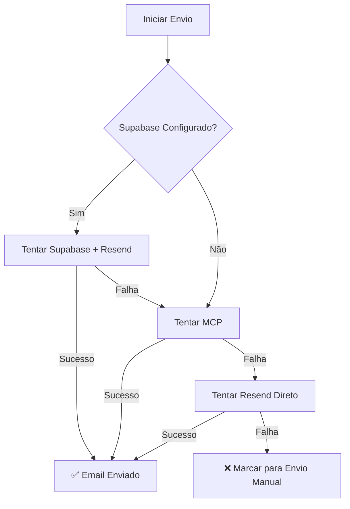

# 📧 Integração Supabase + Resend

## 🎯 Objetivo

Esta documentação descreve a implementação da integração entre **Supabase** e **Resend** para o sistema de envio de emails do projeto CurriculoGratisOnline, especialmente para o sistema de bônus.

## 🏗️ Arquitetura da Solução

### Hierarquia de Envio de Email

1. **🥇 Primeira Opção: Supabase + Resend**
   - Utiliza Edge Functions do Supabase
   - Integração nativa com Resend API
   - Melhor performance e confiabilidade

2. **🥈 Segunda Opção: MCP (Model Context Protocol)**
   - Sistema MCP existente
   - Fallback quando Supabase não está disponível

3. **🥉 Terceira Opção: Resend Direto**
   - Chamada direta para API do Resend
   - Último recurso quando outros métodos falham

## 📁 Estrutura de Arquivos

### Novos Arquivos Criados

```
src/services/
├── supabaseEmailService.ts          # Novo serviço Supabase + Resend
└── ...

public/
├── test-supabase-integration.html    # Página de teste da integração
└── ...
```

### Arquivos Modificados

```
src/components/ui/
├── bonus-popup.tsx                   # Atualizado para usar Supabase
├── bonus-admin.tsx                   # Atualizado para usar Supabase
└── ...
```

## 🔧 Implementação Técnica

### SupabaseEmailService

```typescript
// Principais métodos implementados:

1. sendEmail(emailData: EmailData): Promise<EmailResponse>
   - Envio genérico de email via Supabase Edge Function

2. sendBonusEmail(bonusData: BonusEmailData): Promise<EmailResponse>
   - Envio específico para emails de bônus
   - Template personalizado com substituição de variáveis

3. testConfiguration(): Promise<EmailResponse>
   - Teste de configuração do serviço

4. isConfigured(): boolean
   - Verificação se Supabase está disponível
```

### Integração nos Componentes

#### bonus-popup.tsx
```typescript
// Lógica de envio atualizada:

1. Tentar Supabase + Resend primeiro
2. Se falhar, tentar MCP
3. Se falhar, tentar Resend direto
4. Se tudo falhar, marcar para envio manual
```

#### bonus-admin.tsx
```typescript
// Mesma lógica de fallback implementada
// Interface administrativa mantém compatibilidade
```

## 🌐 Configuração do Supabase

### Pré-requisitos

1. **Projeto Supabase configurado**
2. **Edge Function 'send-email' implementada**
3. **API Key do Resend configurada no Supabase**
4. **Domínio verificado no Resend**: `app.curriculogratisonline.com`

### Variáveis de Ambiente

```env
# Supabase (configurado via interface web)
SUPABASE_URL=sua_url_supabase
SUPABASE_ANON_KEY=sua_chave_anonima

# Resend (configurado no Supabase)
RESEND_API_KEY=re_xxxxxxxxxx
```

## 🧪 Testes

### Página de Teste

Acesse: `http://localhost:8080/test-supabase-integration.html`

**Funcionalidades de Teste:**

1. **Verificação de Configuração**
   - Status do Supabase
   - Status do MCP
   - Variáveis de ambiente

2. **Teste de Envio Simples**
   - Teste via Supabase + Resend
   - Teste via MCP (fallback)
   - Teste via Resend direto

3. **Teste de Email de Bônus**
   - Template completo do bônus
   - Substituição de variáveis
   - Validação de entrega

### Como Testar

```bash
# 1. Iniciar servidor de desenvolvimento
npm run dev

# 2. Acessar página de teste
# http://localhost:8080/test-supabase-integration.html

# 3. Executar testes individuais
# - Configurar email de teste
# - Clicar nos botões de teste
# - Verificar logs em tempo real
```

## 📊 Benefícios da Integração

### 🚀 Performance
- **Edge Functions**: Execução próxima ao usuário
- **Menor Latência**: Redução no tempo de resposta
- **Escalabilidade**: Auto-scaling do Supabase

### 🔒 Segurança
- **API Keys Protegidas**: Não expostas no frontend
- **Autenticação**: Controle de acesso via Supabase
- **Logs Centralizados**: Monitoramento completo

### 🛠️ Manutenibilidade
- **Código Limpo**: Separação de responsabilidades
- **Fallbacks**: Sistema robusto com múltiplas opções
- **Testes**: Página dedicada para validação

## 🔄 Sistema de Fallback

### Fluxo de Execução



### Logs e Monitoramento

```typescript
// Cada tentativa é logada com detalhes:
console.log('🚀 Enviando email via Supabase + Resend para:', email);
console.log('❌ Supabase falhou, tentando MCP...', error);
console.log('✅ Email enviado com sucesso via Supabase!');
```

## 📋 Próximos Passos

### Implementações Futuras

1. **📊 Dashboard de Monitoramento**
   - Estatísticas de envio por método
   - Taxa de sucesso/falha
   - Logs centralizados

2. **🔔 Notificações**
   - Alertas para falhas consecutivas
   - Relatórios de performance

3. **🧪 Testes Automatizados**
   - Testes unitários para cada serviço
   - Testes de integração
   - Monitoramento contínuo

4. **📈 Otimizações**
   - Cache de configurações
   - Retry automático com backoff
   - Load balancing entre provedores

## 🆘 Troubleshooting

### Problemas Comuns

#### 1. Supabase não configurado
```javascript
// Erro: "Supabase não está configurado"
// Solução: Verificar se window.supabase está disponível
if (!window.supabase) {
    console.error('Supabase não inicializado');
}
```

#### 2. Edge Function não encontrada
```javascript
// Erro: "Edge Function 'send-email' não encontrada"
// Solução: Verificar se a função foi deployada no Supabase
```

#### 3. API Key do Resend inválida
```javascript
// Erro: "Unauthorized"
// Solução: Verificar API Key no painel do Supabase
```

### Comandos de Debug

```javascript
// Verificar configuração
SupabaseEmailService.isConfigured();

// Testar configuração
SupabaseEmailService.testConfiguration();

// Obter informações
SupabaseEmailService.getConfigInfo();
```

## 📞 Suporte

Para dúvidas ou problemas:

1. **Verificar logs** na página de teste
2. **Consultar documentação** do Supabase e Resend
3. **Testar configurações** individualmente
4. **Verificar status** dos serviços externos

---

**Última atualização:** Janeiro 2025  
**Versão:** 1.0.0  
**Autor:** Sistema de IA - Assistente de Desenvolvimento